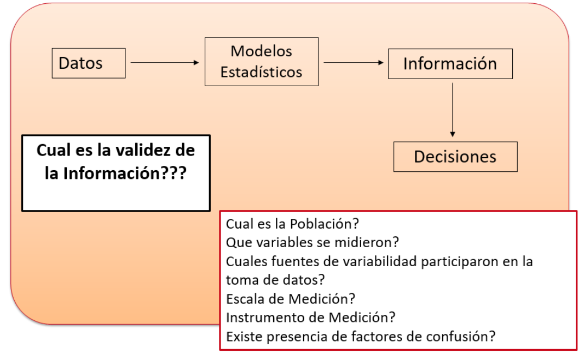
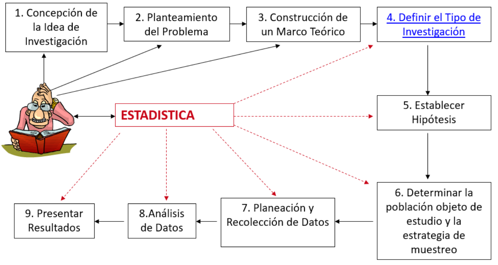
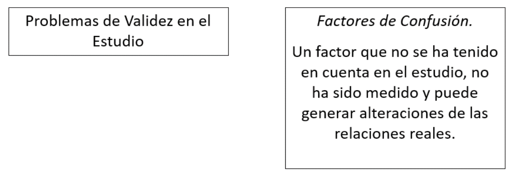
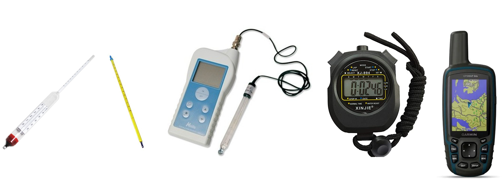
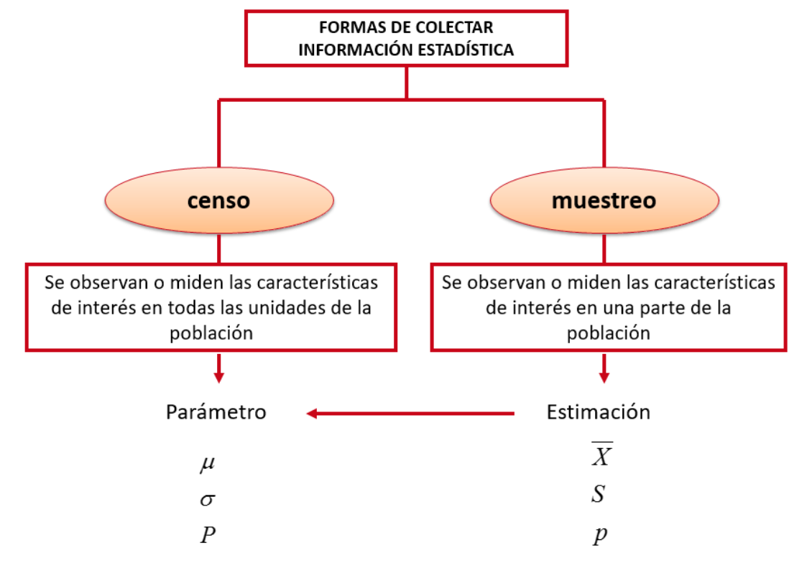
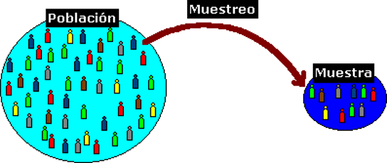
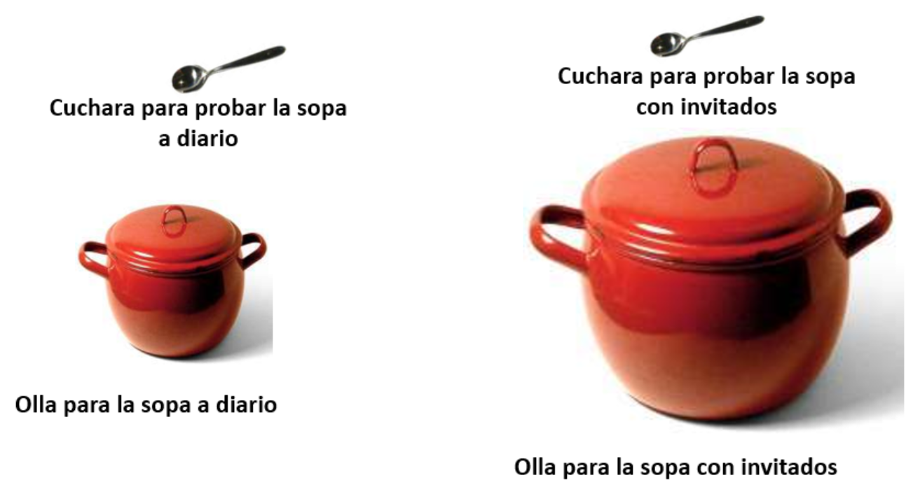
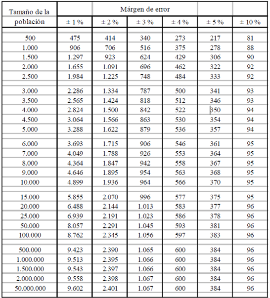
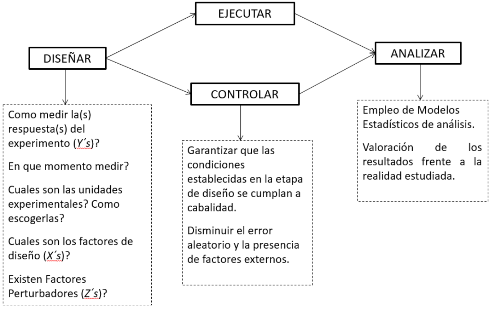
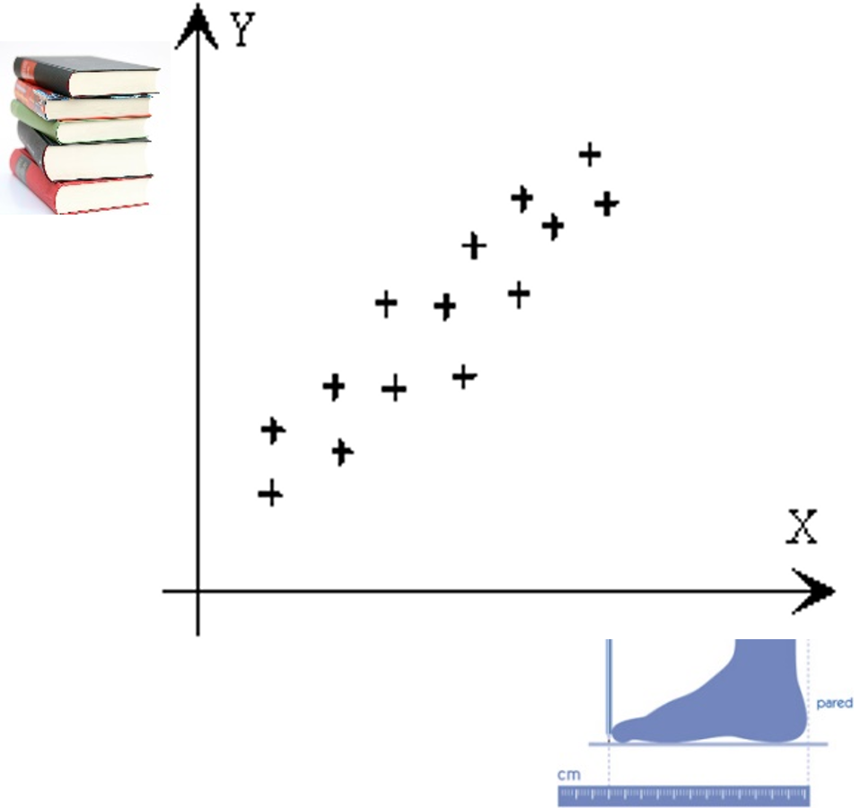

layout: true
background-image: url(Logos/UNAL.png)
background-size: 15%
background-position: 0% 100%

---

```{r setup, include=FALSE}
options(htmltools.dir.version = FALSE)
knitr::opts_chunk$set(
  fig.width=9, fig.height=3.5, fig.retina=3,
  out.width = "100%",
  cache = FALSE,
  echo = TRUE,
  message = FALSE, 
  warning = FALSE,
  fig.show = TRUE,
  hiline = TRUE
)
```

```{r xaringan-themer, include=FALSE, warning=FALSE}
library(xaringanthemer)
style_duo_accent(
  primary_color = "#94b43b",
  secondary_color = "#94b43b",
  inverse_header_color = "#FFFFFF"
)
```

```{r xaringanExtra-scribble, echo=FALSE}
xaringanExtra::use_scribble()
```

```{r xaringanExtra-freezeframe, echo=FALSE, eval=FALSE}
xaringanExtra::use_freezeframe()
```

# Introducción

.pull-left[
La planeación de un experimento es una etapa importante en el desarrollo de una investigación.

### Preguntas importantes


> - Que se quiere evaluar?
>
> - Como se va a hacer?
>
> - Que variables influyen?
>
> - **Cual será el procesamiento de los datos?**

]

.pull-right[
```{r echo=FALSE, out.width = "400px",fig.align='center'}

```
]

---

```{r xaringan-webcam, include = FALSE}
xaringanExtra::use_webcam()
```

# Diseño experimental

En el diseño experimental interviene el método científico, que es la aplicación de la lógica (teoría) y la objetividad (experimentación) al mejor entendimiento de un fenómeno.

<center></center>

---

# ¿Que es un experimento?

Es una prueba o serie de pruebas en las que se hacen cambios deliberados en las variables de entrada (X) de un proceso o sistema para observar e identificar los cambios que pudieran darse en la respuesta de salida (Y).

<center></center>

---
class: inverse center middle

# &#x1f404; Tipos de experimentos en la Ingeniería Agroindustrial

---

.pull-left[
<center></center><br/><br/>

<center></center>

]

.pull-right[
<center></center><br/><br/>

<center></center>

]

---

class: inverse center middle

# &#x1f33e; Objetivos de la experimentación

---

### Tipificar el efecto de los factores controlables sobre la respuesta del sistema

.pull-left[

> - Cual es el calibre adecuado para una bolsa plástica de Polietileno Lineal de Alta Densidad cuya condición de operación requiere una resistencia de 3 mega pascales.
>
> - A  que  temperatura  debe  trabajar  una tostadora de cafe,   para   que   finalmente   el   porcentaje   de humedad sea el aceptable.
>
> - Cual debe ser la velocidad en RPM de una centrifuga para lograr una separación de plasma en una muestra de sangre bovina.

]

.pull-rigth[
<center></center>

]

---

### Optimización del uso de Recursos

- ¿Que cantidad de fertilizante se debe aplicar en la cosecha de la variedad  IR8 de arroz?<br/>
- ¿Que porcentaje de almidón debe tener un genotipo de yuca destinado para la fabricación pandebonos y pan de yuca?<br/>
- ¿Que cantidad de lamina de agua se debe aplicar a un cultivo de zapallo para obtener una cosecha aceptable en materia seca?

.pull-left[
<center></center>

]

.pull-rigth[

<center></center>
]

---

### Valoración de alternativas

Se  tienen  3  ubicaciones  posibles  para  una  bodega  de almacenamiento  de   papa,   cual   de   las   tres   es   mas conveniente,    de    tal    manera    que    la    perdida    por deshidratación de la papa sea la menor.<br/><br/>

¿Datos Históricos o Diseño de Experimentos?

.pull-left[
<center></center>

]

.pull-rigth[

<center></center>
]

---

class: inverse center middle

# &#x1f33e; Proceso de la investigación

---

<center></center>

---

<center></center>

---
class: inverse center middle

# &#x1f33e; Validez de una investigación

---

### El problema no termina con los resultados. En la practica es muy común encontrar relaciones estadísticas donde no existen relaciones reales.
<br/><br/>

.pull-left[
<center></center>

]

.pull-rigth[
<center></center>

]

---

### Validez: Es el grado de valor que se confiere a la información.

> Validez interna.
>
> Validez Externa. 


### Validez interna
.pull-left[

Hace referencia al grado en que la medición refleja la situación que se pretende medir. Garantizar la comparabilidad.

- ¿El instrumento de medición es adecuado?
- ¿La medición esta bien tomada?
- ¿La medición es confiable y repetible?

]

.pull-rigth[
<center></center>
]

---

### Validez externa

Hace referencia al grado en que la medición puede generalizarse a otras situaciones no medidas.

- La medición puede extrapolarse?
- La muestra conformada es representativa?
- Si un estudio no tiene validez interna, no puede tener validez externa.

### Ejemplo

Se desea evaluar el efecto de una deshidratación osmótica sobre el contenido de humedad del Melón. Para ello se tiene **1** melón el cual es fraccionado un varias partes y a cada una de ellas se le registra el porcentaje de perdida de humedad en diferentes instantes de tiempo.

.pull-left[

Finalmente se encuentra que efectivamente disminuye el porcentaje de humedad significativamente al cabo de 15, 30 y 60 minutos.

]

.pull-rigth[

<center></center>

]

---

class: inverse center middle

### Un solo Melon?
<br/>
###No hay validez Externa!!!
<br/>
### Depende en gran medida de la conformación de la Muestra

---
### Conformación de la muestra

<center></center>

---
### Las características que diferencian el censo del muestreo son:

El Error muestral es la diferencia entre la realidad (parámetro)y la estimación basada en la muestra. El censo no presenta este tipo de error.

El Error No muestral se genera por el procedimiento del censo o muestreo durante la operación de recolección. Ejemplo: preguntas mal formuladas, mediciones mal realizadas, errores de tabulación, errores de interpretación.

<center></center>

---
class: inverse center middle

# &#x1f4ca; Tamaño de Muestra

---

<center></center>


#### <center>El tamaño de muestra no es proporcional al tamaño de la poblacion</center>

---

### En la determinación del tamaño de muestra intervienen 3 aspectos fundamentales:

.pull-left[ 
>Variabilidad de la característica a medir.
>
>Nivel de Confianza deseado.
>
>Máximo Error deseado

<center></center>

]

.pull-right[ 

<center></center>

]

---

### Fases de un experimento

<center></center>

---
class: center middle

### El problema no termina con los resultados!
<br/>
####“Antes de entregar resultados apresurados, estos deben validarse en su contexto y realizar una valoración de los Factores de Confusión”
<br/>

.pull-left[ 

“Por ejemplo, un estudio puede demostrar que existe una relación directa entre el tamaño del pie de un niño y su dominio de la lectura”

Estadísticamente está relación existe, pero en la realidad representa causalidad?

#### En la práctica es muy común encontrar relaciones estadísticas donde no existen relaciones reales

[Correlaciones falsas](https://www.tylervigen.com/spurious-correlations)

]

.pull-rigth[
<center></center>
]

---
### Factores que Influyen en el éxito de un experimento

> **Experticia del investigador**: Uso de conocimientos previos (adquiridos o documentados) en el diseño y análisis del experimento.
>
> **Validez Interna (control)**: Grado de comparabilidad de las mediciones de diferentes unidades experimentales.
>
> **Validez Externa**: Grado en el que los descubrimientos de la experimentación pueden generalizarse a situaciones cotidianas (diferentes lugares, personas, procesos, materiales).

<center></center>

---
> **Análisis de datos**: Dominio de las técnicas estadísticas descriptivas e inferenciales para el abordaje del error experimental (Incertidumbre).
>
> **Estadística Descriptiva**:Medidas de tendencia central (media, Mediana)
Variabilidad, dispersión, posición (desviación, Cuartiles)
Herramientas graficas (BoxPlot, Histograma, Pastel, Barras)
>
> **Inferencia Estadística**:Intervalos de confianza (Media, Varianza, Proporciones) Pruebas de hipótesis - Valor-P (Media, Varianza, Proporciones)

<br/>
<center></center>
---
class: inverse center middle

## _“Llegará el día en el que el pensamiento estadístico será una condición tan necesaria para la convivencia eficiente como la capacidad de leer y escribir”_ — Herbert George Wells

---

class: center, middle

## Gracias muchach@s!!

<center></center>
<br/>

Slides created via the R package [**xaringan**](https://github.com/yihui/xaringan).
